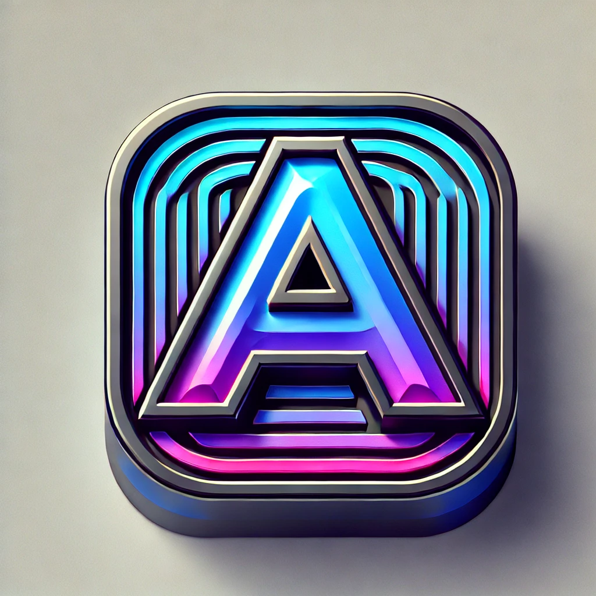

# 🎨 INDYARTZ - The Ultimate Artist Hub 🎶

Welcome to **INDYARTZ**, the all-in-one platform for **artists, musicians, designers, and content creators** to connect, showcase their work, and monetize their talents.



## 🌟 **Live Website**
🔗 **[Visit INDYARTZ](https://srlabreeze.github.io/Indyartzwebb/)**  

---

## **🚀 Features**
✅ **Artist Profiles** – Customize your profile & showcase your work.  
✅ **Music Uploads** – Share and distribute your tracks.  
✅ **Streaming Hub** – Listen to independent artists.  
✅ **Event Promotions** – Get discovered by fans & event organizers.  
✅ **Verification Badges** – Verified artists, ambassadors, and the exclusive owner badge.  
✅ **Dark Futuristic UI** – A sleek, modern interface designed for artists.  

---

## **📂 Project Structure**
```plaintext
Indyartzwebb/
│── index.html        # Main homepage
│── style.css        # Website styling
│── script.js        # Interactive features
│── assets/          # Icons, images, and design elements
│   ├── app-icon.png
│   ├── verified-badge.png
│   ├── ambassador-badge.png
│   ├── owner-badge.png
│   ├── hero-background.jpg
│── pages/           # Subpages
│   ├── upload.html
│   ├── profile.html
│   ├── music.html
│── README.md        # Project description (this file)
